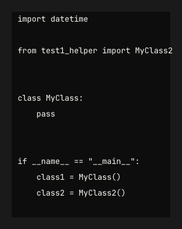
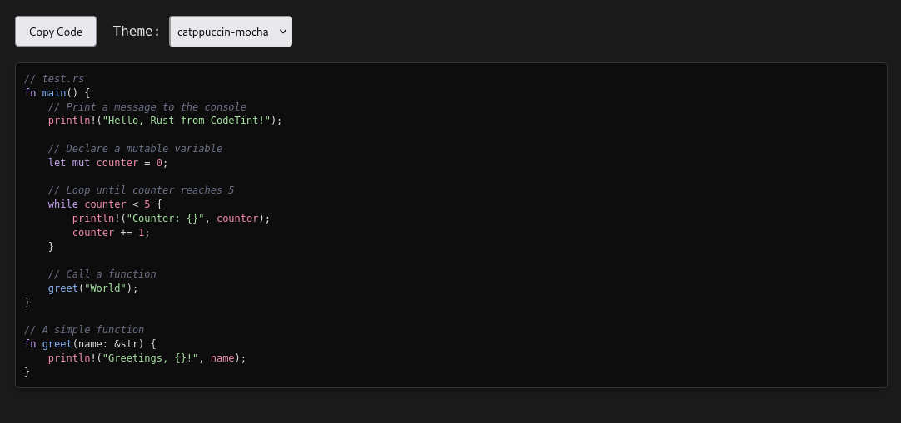

# CodeTint

## Introduction

`CodeTint` is a lightweight and powerful command-line utility designed for fast and accurate syntax highlighting of source code. Built entirely in C and leveraging the robust parsing capabilities of **Tree-sitter**, `CodeTint` provides highly detailed and precise highlighting. Currently, it offers comprehensive support for various programming languages, transforming plain text into visually appealing, color-coded output.

Functioning much like the classic `cat` command, `CodeTint` reads your source files and outputs their content, but with the added benefit of beautiful syntax highlighting. You can choose to display the highlighted code directly in your terminal using **ANSI escape codes**, generate **HTML** output for web integration or browser viewing, or even create **PNG images** of your code snippets. `CodeTint` aims to provide a quick, efficient, and visually enhanced way to view your code.

---

## Installation

To get `CodeTint` up and running, follow these steps:

### Prerequisites

- **C Compiler:** You'll need a C compiler like GCC or Clang.
- **Git:** To clone the repository and its submodules.

### Build Steps

1.  **Clone the Repository:**
    Start by cloning the `CodeTint` repository from GitHub:

    ```bash
    git clone https://github.com/Harshit-Dhanwalkar/CodeTint.git
    cd CodeTint
    ```

2.  **Initialize Submodules:**
    `CodeTint` uses Git submodules for `tree-sitter`, various `tree-sitter-*` grammars, and the `stb` library. Initialize and update them:

    ```bash
    git submodule update --init --recursive
    ```

    This will download the necessary Tree-sitter core library, language grammars, and the `stb` headers into their respective subdirectories.

3.  **Prepare Fonts:**
    For the image generation feature, you need to place your desired TrueType Font (`.ttf`) files inside the `modules/Fonts/` directory. `CodeTint` will discover these fonts when generating images.

    For example, if you downloaded `JetBrainsMono-2.304.zip` and `Fira_Code_v6.2.zip`, extract the `.ttf` files into subdirectories like:

    ```
    CodeTint/
    └── modules/
        └── Fonts/
            ├── JetBrainsMono-2.304/
            │   └── JetBrainsMono-Regular.ttf
            ├── Fira_Code_v6.2/
            │   └── FiraCode-Regular.ttf
            └── ... (other .ttf files)
    ```

    - **JetBrains Mono:** Available from [https://www.jetbrains.com/lp/mono/](https://www.jetbrains.com/lp/mono/)
    - **Fira Code:** Available from [https://github.com/tonsky/FiraCode](https://www.jetbrains.com/lp/mono/)

4.  **Compile the Main `CodeTint` Application:**
    Navigate back to your project's root directory (`CodeTint/`). Use the following `gcc` command to compile `CodeTint`. This command includes common warning flags (`-Wall`, `-Wextra`), debugging information (`-g`), and links all the necessary Tree-sitter source files and grammars, along with `libcodeimage.c` and `modules/theme.c` directly:

    ```bash
    gcc -Wall -Wextra -g -Imodules -Imodules/stb -I./tree-sitter/lib/include -I./tree-sitter-python/src -I./tree-sitter-c/src -I./tree-sitter-cpp/src/ -I./tree-sitter-javascript/src -I./tree-sitter-html/src -I./tree-sitter-css/src -I./tree-sitter-rust/src -I./tree-sitter-bash/src codetint.c modules/theme.c modules/libcodeimage.c ./tree-sitter/lib/src/lib.c ./tree-sitter-python/src/parser.c ./tree-sitter-python/src/scanner.c ./tree-sitter-c/src/parser.c ./tree-sitter-cpp/src/parser.c ./tree-sitter-cpp/src/scanner.c ./tree-sitter-javascript/src/parser.c ./tree-sitter-javascript/src/scanner.c ./tree-sitter-html/src/parser.c ./tree-sitter-html/src/scanner.c ./tree-sitter-css/src/parser.c ./tree-sitter-css/src/scanner.c ./tree-sitter-rust/src/parser.c ./tree-sitter-rust/src/scanner.c ./tree-sitter-bash/src/parser.c ./tree-sitter-bash/src/scanner.c -lm -o codetint
    ```

Your `CodeTint` executable is now ready to use!

---

## Usage

`CodeTint` is a command-line tool designed to display syntax-highlighted code.

### Basic Usage

To highlight a file and display it directly in your terminal:

```bash
./codetint <your__file>
```

### Options

- **`-i FILE`**: Input code file to convert (e.g., `my_script.c`). **This is a mandatory option for image generation.**
- **`-f FONT_NAME`**: Selects a specific font by its discovered name (e.g., `JetBrainsMono-Regular`, `FiraCode-Regular`). Run `./codetint --image-out /dev/null --help` to see a list of available fonts.
- **`-fs SIZE`**: Sets the font size in pixels for image output (e.g., `-fs 24`).
- **`-w WIDTH`**: Sets the image width in pixels (default: calculated based on content, or 200 if no content).
- **`-h HEIGHT`**: Sets the image height in pixels (default: calculated based on content, or 100 if no content).
- **`OUTPUT_PATH.png`**: (Positional argument) Specifies the output filename and path for the image (e.g., `my_custom_code.png`). If omitted, defaults to `highlighted_code.png`.
- **`-c THEME`**: Selects a color theme (default: `default`).
- **`-l LANG`**: Explicitly sets the language (e.g., `python`, `c`, `javascript`). Overrides file extension detection.
- **`-o FILE`**: Outputs to a file instead of `stdout` (for HTML/ANSI).
- **`--html`**: Outputs HTML instead of ANSI colors.
- **`-n, --line-numbers`**: Shows line numbers.
- **`--image-out FILE`**: Generates image output (PNG) to FILE.
- **`--image-font FONT_NAME`**: Specifies the font for image output (e.g., `JetBrainsMono-Regular`).
- **`--image-fs SIZE`**: Sets the font size for image output (e.g., `24.0`).
- **`--image-w WIDTH`**: Sets image width (0 for auto-calculation).
- **`--image-h HEIGHT`**: Sets image height (0 for auto-calculation).
- **`--help` or `-u`**: Displays the usage information.

### Examples

**1. Generate an image from a Python script with JetBrains Mono font:**

This example assumes you have a sample Python file located at `examples/test1.py` within your project:
Bash

```bash
./codetint examples/test1.py --image-out assets/output.png --image-font "JetBrainsMono-Regular" --image-fs 18
```

This command will read `examples/test1.py`, render its content using the `JetBrainsMono-Regular` font at 18px size, and save the syntax-highlighted output directly to `assets/output.png`. The image dimensions will be automatically calculated to fit the code content unless overridden by `-w` and `-h`.

**Example Output Images:**

These `.png` files are directly generated by CodeTint and stored in your `assets/` directory.

Python Code Example:



**2. Generate HTML output for a Python script:**

This example shows how to generate syntax-highlighted HTML for rust file (examples/test.rc).

```bash
./codetint examples/test.rs --html -o assets/output-rust.html
```

Below is a screenshot showcasing how the generated `assets/output-rust.html`
might look when viewed in a web browser.

Rust Code Example:



---

**See available fonts:**

Due to how libcodeimage discovers fonts, you can trigger its font discovery and list them by running:

```bash
./codetint --image-out /dev/null --help
```

(The `--image-out /dev/null` part prevents it from trying to write an actual image, just triggering the font discovery path.)

---

### Adding More Fonts

Simply place your .ttf font files into the `modules/Fonts/` directory or any of its subdirectories. The utility will automatically discover them and list them when you run `./codetint --image-out /dev/null --help`.

---

## TODO

Here are some features and improvements planned for CodeTint:

- [x] Add highlighting for other languages: Extend support beyond Python to highlight a variety of programming and scripting languages.
  - [x] python
  - [x] Rust
  - [x] C
  - [x] C++
  - [x] Javascript
  - [x] html
  - [x] css
  - [x] bash
  - [ ] lua
- [x] Add line numbers: Implement an option to display line numbers alongside the highlighted code.
- [x] Optimize code by separating themes: Move theme definitions from main.c into separate files or a more modular structure for easier management and extensibility.
- [x] Allow piping output into a code block image: Integrate image generation directly into the tool via libcodeimage.so.
- [ ] Support for incremental parsing (Live Update): Extend this tool to watch files for changes and update highlighting live. This would involve using ts_parser_parse and re-parsing only changed parts for efficiency.
- [ ] Support for piping input: Allow CodeTint to read code directly from standard input (stdin), enabling use in pipelines (e.g., cat file.py | ./codetint).
- [ ] External theme configuration: Implement a mechanism to load themes from external configuration files (e.g., JSON, YAML) without recompilation.
- [ ] Configuration file support: Add a configuration file (e.g., .codetintrc) for default settings, such as preferred theme or default language.
- [ ] More robust error handling: Improve error messages and handling for file operations, parsing, and invalid arguments.
- [ ] Support for different line ending styles: Ensure correct rendering across various operating systems (Windows, Linux, macOS).
- [ ] Packaging and Distribution: Explore options for easier installation via package managers.

---

## FIXES

- [x] Output HTML is not showing color when applied colorscheme using dropdown menu.
- [x] Dark background
- [ ] Fix copy to clipboard button in HTML
- [ ] Code-to-Image output does not show syntax highlighting.
