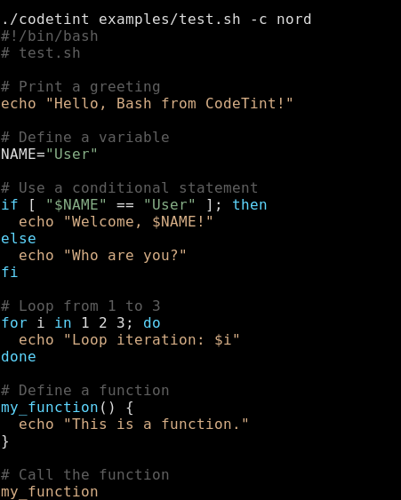
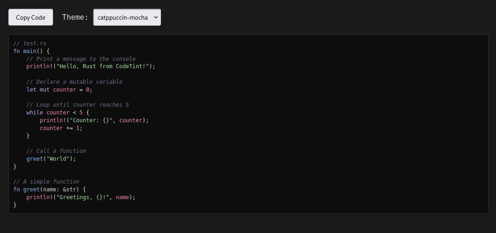
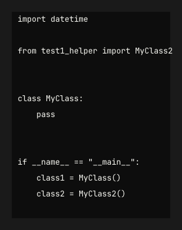

# CodeTint

## Introduction

`CodeTint` is a lightweight, powerful command-line utility for fast and accurate syntax highlighting of source code. Built in C with **Tree-sitter** parsing, it transforms plain text into beautifully highlighted output with support for:

- **Terminal display** (ANSI colors)
- **HTML output** (for web/browser viewing)
- **PNG image generation** (for sharing code snippets)
- **Interactive pager mode** (for long files)

## Key Features

- 🚀 **Blazing fast** parsing and highlighting
- 🌈 **Multiple color themes** included
- 📜 **Interactive pager** for large files (like `less`)
- 📊 **Line number** support
- 🖼️ **Code-to-image** conversion
- 💻 **Cross-platform** (Linux, macOS, WSL)

## Installation

### Prerequisites

- **C Compiler:** You'll need a C compiler like GCC or Clang.
- **Git:** To clone the repository and its submodules.
- Installing other important dependencies, for debian using apt package manager:
  ```bash
  sudo apt-get update
  sudo apt-get install libx11-dev libfontconfig1-dev libharfbuzz-dev libpng-dev libfreetype-dev
  ```

### Building from Source

1.  **Clone the Repository:**

    ```bash
    git clone https://github.com/Harshit-Dhanwalkar/CodeTint.git
    cd CodeTint
    git submodule update --init --recursive
    ```

    This will download the necessary Tree-sitter core library, language grammars, and the `stb` headers into their respective subdirectories.

2.  **Prepare Fonts:**
    For the image generation feature, you need to place your desired TrueType Font (`.ttf`) files inside the `modules/Fonts/` directory. `CodeTint` will discover these fonts when generating images.

    - **JetBrains Mono:** Available from [https://www.jetbrains.com/lp/mono/](https://www.jetbrains.com/lp/mono/)
    - **Fira Code:** Available from [https://github.com/tonsky/FiraCode](https://github.com/tonsky/FiraCode)
    - **Hack:** Available from [https://sourcefoundry.org/hack/](https://sourcefoundry.org/hack/)
    - **Monoid:** Available from [https://larsenwork.com/monoid/](https://larsenwork.com/monoid/)
    - **Input Mono:** Available from [https://input.djr.com/download/](https://input.djr.com/download/)
    - **Space Mono:** Available from [https://fonts.google.com/specimen/Space+Mono](https://fonts.google.com/specimen/Space+Mono)

    For example, if you downloaded `JetBrainsMono-2.304.zip`, `Fira_Code_v6.2.zip`, `Hack-v3.003-ttf.zip`, `Monoid.zip`, `Input-Font.zip`, and `Space_Mono.zip`, extract the `.ttf` files into subdirectories like:

    ```
    CodeTint/
    └── modules/
        └── Fonts/
            ├── JetBrainsMono-2.304/
            │   └── JetBrainsMono-Regular.ttf
            ├── Fira_Code_v6.2/
            │   └── FiraCode-Regular.ttf
            ├── Hack/
            │   └── Hack-Regular.ttf
            ├── Monoid/
            │   └── Monoid-Regular.ttf
            ├── Input-Font/
            │   └── InputMono-Regular.ttf
            ├── Space_Mono/
            │   └── SpaceMono-Regular.ttf
            └── ... (other .ttf files)
    ```

3.  **Compile**
    `bash
make
`
    Note: For more see [Makefile](Makefile)

---

## Supported Languages

Currently `CodeTint` supports limited languages:

1.  Python (`.py`)
2.  C/C++ (`.c`, `.cpp`, `.h`)
3.  JavaScript (`.js`)
4.  HTML (`.html`)
5.  CSS (`.css`)
6.  Rust (`.rs`)
7.  Bash (`.sh`)

## Themes

Available themes: `default`, `nord`, `dracula`, `gruvbox`, `one-dark`, `monokai`, `solarized-dark`, `solarized-light`

## Usage

`CodeTint` is a command-line tool designed to display syntax-highlighted code.

### Basic Usage

To highlight a file and display it directly in your terminal:

```bash
./codetint <your__file>
```

### Options

| Option                       | Description                                                               |
| :--------------------------- | :------------------------------------------------------------------------ |
| **`-i FILE`**                | Input code file for image generation (mandatory for image generation).    |
| **`-f FONT_NAME`**           | Selects a specific font for image output (e.g., `JetBrainsMono-Regular`). |
| **`-fs SIZE`**               | Sets the font size in pixels for image output (e.g., `24`).               |
| **`-w WIDTH`**               | Sets the image width in pixels (default: calculated).                     |
| **`-h HEIGHT`**              | Sets the image height in pixels (default: calculated).                    |
| **`-p, --pager`**            | Uses an interactive pager for long files.                                 |
| **`-c THEME`**               | Selects a color theme (default: `default`).                               |
| **`-l LANG`**                | Explicitly sets the language, overriding file extension.                  |
| **`-o FILE`**                | Outputs to a file instead of `stdout`.                                    |
| **`--html`**                 | Outputs HTML format.                                                      |
| **`-n, --line-numbers`**     | Shows line numbers.                                                       |
| **`--image-out FILE`**       | Generates image output (PNG) to a specified file.                         |
| **`--image-font FONT_NAME`** | Specifies the font for image output.                                      |
| **`--image-fs SIZE`**        | Sets the font size for image output.                                      |
| **`--image-w WIDTH`**        | Sets image width (0 for auto-calculation).                                |
| **`--image-h HEIGHT`**       | Sets image height (0 for auto-calculation).                               |
| **`--help` or `-u`**         | Displays usage information.                                               |

#### Pager Mode Navigation

When using `-p` flag:
| Key | Action |
| :--- | :--- |
| **Space** | Next page |
| **b** | Previous page |
| **j** | Down one line |
| **k** | Up one line |
| **q** | Quit |

### Examples

**1. Printing into terminal from script/code file with syntax-highlighting:**

This example shows how to print syntax-highlighted code for bash script file (examples/test.sh).

```bash
./codetint examples/test.sh -c nord
```

Bash-script Example:



**2. Generate HTML output code:**

This example shows how to generate syntax-highlighted HTML for rust file (`examples/test.rc`).

```bash
./codetint examples/test.rs --html -o assets/output-rust.html
```

Below is a screenshot showcasing how the generated `assets/output-rust.html`
might look when viewed in a web browser.

Rust Code Example:



**3. Generate an image from a script with JetBrains Mono font:**

This example assumes you have a sample Python file located at `examples/test1.py` within your project:

```bash
./codetint examples/test1.py --image-out assets/output-python.png --image-font "JetBrainsMono-Regular" --image-fs 18
```

This command will read `examples/test1.py`, render its content using the `JetBrainsMono-Regular` font at 18px size, and save the syntax-highlighted output directly to `assets/output-python.png`. The image dimensions will be automatically calculated to fit the code content unless overridden by `-w` and `-h`.

**Example Output Images:**

These `.png` files are directly generated by CodeTint and stored in your `assets/` directory.

Python Code Example:



---

**See available fonts:**

Due to how libcodeimage discovers fonts, you can trigger its font discovery and list them by running:

```bash
./codetint --image-out /dev/null --help
```

(The `--image-out /dev/null` part prevents it from trying to write an actual image, just triggering the font discovery path.)

---

### Adding More Fonts

Simply place your .ttf font files into the `modules/Fonts/` directory or any of its subdirectories. The utility will automatically discover them and list them when you run `./codetint --image-out /dev/null --help`.

---

## TODO

Here are some features and improvements planned for CodeTint:

- [x] Add highlighting for other languages: Extend support beyond Python to highlight a variety of programming and scripting languages.
  - [x] python
  - [x] Rust
  - [x] C
  - [x] C++
  - [x] Javascript
  - [x] html
  - [x] css
  - [x] bash
  - [ ] lua
- [x] Add line numbers: Implement an option to display line numbers alongside the highlighted code.
- [x] Optimize code by separating themes: Move theme definitions from main.c into separate files or a more modular structure for easier management and extensibility.
- [x] Allow piping output into a code block image: Integrate image generation directly into the tool via libcodeimage.so.
- [ ] Support for incremental parsing (Live Update): Extend this tool to watch files for changes and update highlighting live. This would involve using ts_parser_parse and re-parsing only changed parts for efficiency.
- [ ] Support for piping input: Allow CodeTint to read code directly from standard input (stdin), enabling use in pipelines (e.g., cat file.py | ./codetint).
- [ ] External theme configuration: Implement a mechanism to load themes from external configuration files (e.g., JSON, YAML) without recompilation.
- [ ] Configuration file support: Add a configuration file (e.g., .codetintrc) for default settings, such as preferred theme or default language.
- [ ] More robust error handling: Improve error messages and handling for file operations, parsing, and invalid arguments.
- [ ] Support for different line ending styles: Ensure correct rendering across various operating systems (Windows, Linux, macOS).
- [ ] Packaging and Distribution: Explore options for easier installation via package managers.

---

## FIXES

- [x] Output HTML is not showing color when applied colorscheme using dropdown menu.
- [x] Dark background
- [ ] Fix copy to clipboard button in HTML
- [ ] Code-to-Image output does not show syntax highlighting.

---

# License
